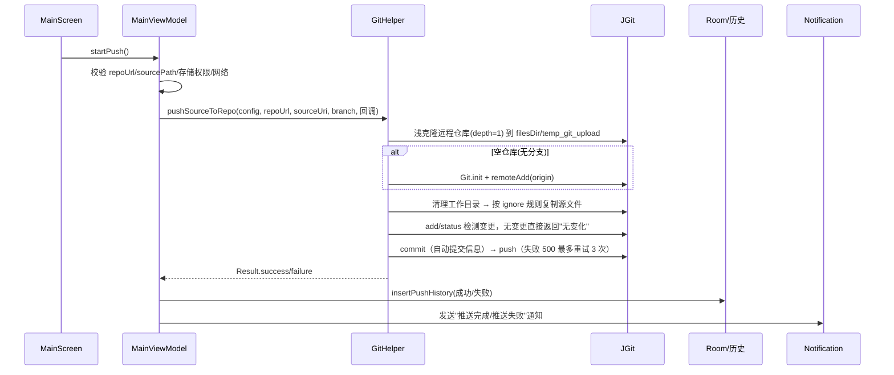
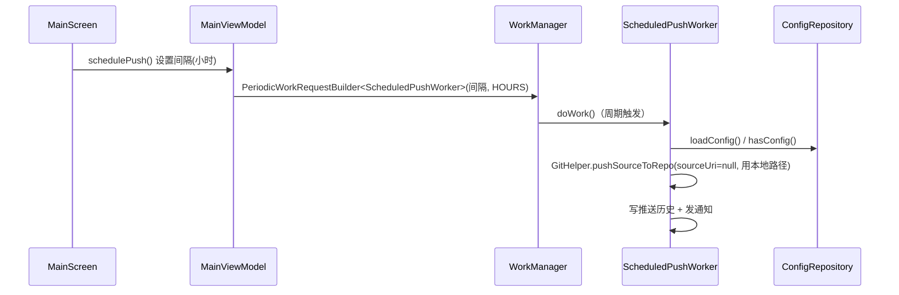

# 02 - 整体架构

## 1. 架构风格

项目采用 **单 Activity + MVVM** 架构，配合 **单向数据流（UDF）**：

- 单一入口 `MainActivity`，不采用 Navigation 组件做多页面跳转，所有"页面"以**对话框（Dialog）**形式叠加在同一个 Compose 界面（`MainScreen`）之上。
- `MainViewModel` 是业务中枢，持有唯一的 UI 状态源 `MainUiState`（`MutableStateFlow`）。
- UI 层通过 `collectAsStateWithLifecycle()` 订阅状态并回调 ViewModel 方法。
- 耗时操作（JGit / 网络 / Room）在 `viewModelScope` + `Dispatchers.IO` 中执行，进度与日志通过回调写回状态。

## 2. 分层视图

```
┌───────────────────────────────────────────────────────────────┐
│  UI 层  (app/src/main/java/com/jack/pushgithub/ui)            │
│  MainScreen.kt · ConfigDialog.kt · theme/                     │
│  Compose 可组合函数 + 各类 Dialog                              │
└───────────────────────────────┬───────────────────────────────┘
                                │ StateFlow 订阅 / 方法调用
┌───────────────────────────────▼───────────────────────────────┐
│  ViewModel 层 (viewmodel/MainViewModel.kt)                    │
│  状态持有：MainUiState(StateFlow)                              │
│  业务编排：推送/下载/清空/定时/历史/配置 全部在此触发             │
└───────┬───────────────┬───────────────┬───────────────────────┘
        │               │               │
        ▼               ▼               ▼
┌───────────────┐ ┌───────────────┐ ┌──────────────────────────┐
│ 领域/服务层     │ │  Git 层        │ │ GitHub API 层            │
│ platform/     │ │  git/         │ │ github/GithubApi.kt     │
│ GitPlatform   │ │  GitHelper    │ │ OkHttp 封装              │
│ (平台抽象)     │ │  DocumentFileCopy│ │ network/GithubVerify    │
│               │ └───────────────┘ └──────────────────────────┘
└───────────────┘        │
                         │ 依赖
                         ▼
┌───────────────────────────────────────────────────────────────┐
│  数据层 (data/)                                               │
│  Room：AppDatabase · RepoConfigDao · PushHistoryDao           │
│  EncryptedSharedPreferences：ConfigRepository(GitConfig)      │
├───────────────────────────────────────────────────────────────┤
│  基础设施：notification/ · worker/ · network/NetworkUtils     │
│  ScheduledPushWorker(WorkManager 周期性推送)                  │
└───────────────────────────────────────────────────────────────┘
```

## 3. 核心数据流

### 3.1 手动推送源码（主流程）



要点：
- 每次推送都**重新浅克隆**（`depth=1`），删除旧临时目录，保证与远程同步且速度快。
- 克隆完成后**关闭克隆连接，重新 `Git.open`**，push 时新建 HTTP 连接，规避大文件推送时的连接问题。
- push 通过 `RefSpec("HEAD:refs/heads/$branch")` 指定目标分支；HTTP 500 时指数退避重试最多 3 次。
- 通过 `configureRepoForPush()` 限制 JGit pack 内存（window/depth/windowMemory 等）并加大 `http.postBuffer` 到 500MB，解决 Android 受限堆 OOM 与大文件 500 错误。

### 3.2 定时推送（后台流程）



要点：
- `ScheduledPushWorker` 是 `CoroutineWorker`，从 `inputData` 读取 repoUrl/sourcePath/branch/platform。
- 由于定时任务运行在后台（可能无 SAF 权限上下文），`sourceUri` 固定传 `null`，依赖"所有文件访问"权限下的本地路径。
- `cancelScheduledPush()` 通过 `WorkManager.cancelAllWork()` 取消全部定时任务。

### 3.3 下载源码

`MainViewModel.startDownload()` → `GitHelper.cloneDownload(repoUrl, destPath, ...)`：
- 直接 `Git.cloneRepository()` 克隆到用户指定路径（默认 `/storage/emulated/0/github下载源码/<repoName>/`）。
- 通过 `ProgressMonitor` 将下载进度映射到 5%→100% 进度条（10%~90% 区间随下载量推进）。

### 3.4 清空仓库（两种方式）

1. **快速清空**：`GithubApi.clearRepositoryFast(owner, repo)`，纯 REST 实现：
   获取最新 commit SHA → 创建空 blob(.gitkeep) → 创建新 tree → 创建 commit → PATCH 更新分支引用。一次提交完成清空，速度快。
2. **选择文件删除**：`GithubApi.getRepositoryFiles()`（递归 tree API）列出文件 → 勾选 → `deleteFiles()` 逐文件调用 `DELETE /contents/{path}`（需传 sha + branch）。

## 4. 状态管理（MainUiState）

`MainUiState`（[MainViewModel.kt](../app/src/main/java/com/jack/pushgithub/viewmodel/MainViewModel.kt)）是一个全量数据类，覆盖全部 UI 状态，主要分组：

| 分组 | 字段 |
| --- | --- |
| 凭据 | `config`、`hasConfig`、`showConfigDialog`、`isFirstTime` |
| 推送目标 | `repoUrl`、`branch`、`sourceDirDisplayName`、`sourceDirUri` |
| 运行状态 | `isWorking`、`statusMessage`、`errorMessage`、`progressVisible`、`progress` |
| 日志 | `logMessages`、`logFilter` |
| 多仓库 | `repoConfigs` |
| 历史 | `pushHistory`、`showHistory` |
| 提交历史 | `showCommitHistory`、`commitHistory`、`isLoadingCommits` |
| 文件预览 | `showFilePreview`、`previewFiles` |
| 定时 | `showScheduleDialog`、`scheduleIntervalHours` |
| 清空仓库 | `showClearOptionsDialog`、`showFileSelector`、`repoFiles`、`selectedFilePaths` |
| 权限 | `hasStoragePermission`、`showStoragePermissionDialog` |
| 下载 | `showDownloadDialog`、`downloadPath` |
| 源码目录 | `showSourceDirDialog` |

所有修改均通过 `_uiState.update { it.copy(...) }` / `_uiState.value = ...` 完成，保证单一数据源。

## 5. 存储方案

| 数据 | 存储方式 | 说明 |
| --- | --- | --- |
| Git 凭据（邮箱/用户名/Token） | `EncryptedSharedPreferences`（文件 `github_config_encrypted`，MasterKey AES256_GCM） | 敏感信息，加密存储 |
| 推送历史 | Room `push_history` 表 | 记录 repoUrl/branch/sourcePath/成功标志/时间/消息 |
| 仓库配置 | Room `repo_config` 表 | 常用仓库 name/url/branch/createTime |
| 临时 Git 工作区 | `context.filesDir/temp_git_upload` | 推送后删除；下载克隆到用户指定路径 |

## 6. 权限与安全设计

- `MainActivity` 在 `ON_RESUME` 时自动检查"所有文件访问"权限，无权限则拉起系统授权页。
- 全局 `UncaughtExceptionHandler`：捕获未捕获异常写日志（debug 输出完整堆栈），并链式调用系统默认处理器，保证崩溃上报。
- 网络层仅允许 HTTPS（`network_security_config.xml`），Token 通过 `Authorization: Bearer` 头传递。
- `RetryInterceptor` 对 5xx 做指数退避重试，IO 异常也重试。

## 7. 潜在注意点（后续维护关注）

- `GithubApi` 硬编码 `api.github.com`，与 `GitPlatform` 的多平台抽象不一致（仅 GitHub 可用）。
- `parseRepoUrl()` 和 `loadCommitHistory()` 里对仓库 URL 的解析逻辑重复，且只兼容 `https://github.com/` 前缀，多平台 URL 会被截错。
- `ScheduledPushWorker.doWork()` 每次新建 Room 实例（`Room.databaseBuilder`），与 App 级单例不一致，但功能上可行。
- `clearRepositoryFast()` 与 `deleteFiles()` 中 `onProgressPercent` 缺省实现不一致（一个默认为空，一个必传），属于轻微接口不一致。
- 定时推送的 source 只能走本地路径（`sourceUri=null`），若用户用 SAF 选择的目录则定时任务无法读取。
